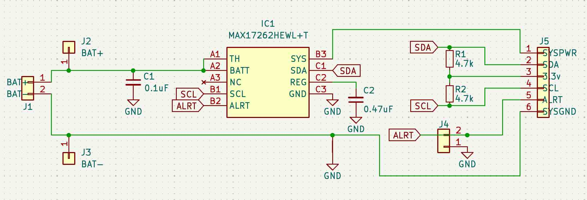
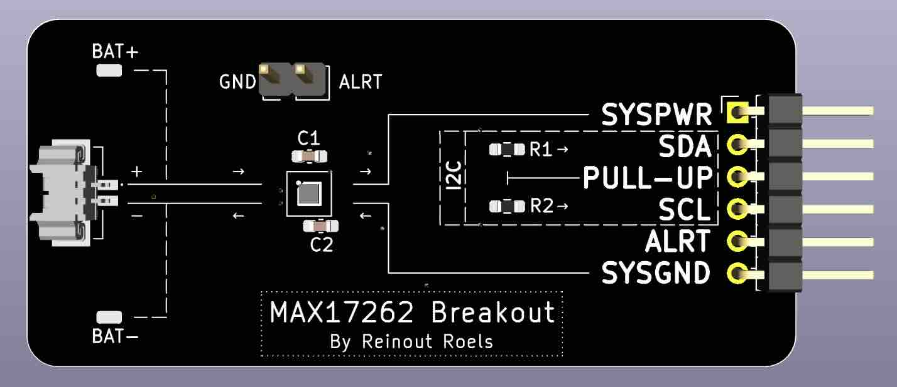
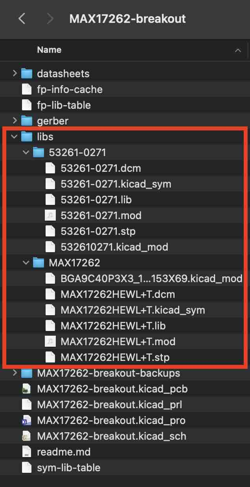

# MAX17262 breakout board

> [!WARNING]
> The information and material (code, designs, files, ...) are provided "AS IS". We make no representation or warranty of any kind, express or implied, regarding the accuracy, adequacy, validity, reliability, availability, or completeness of any information or material. Use this at your own risk.

> [!WARNING]
> At the time of writing this PCB has not even been produced yet, and as such, it has not even been tested yet! Once it has been properly tested, I will confirm that everything works as expected. 

> [!WARNING]
> Note that some batteries have a "reversed" plug with the positive and negatives wires switched, so always make sure that the polarity matches the indications on the board, before plugging anything in! 

## Introduction 

I wanted to use the MAX17262 ultra-low power fuel-gauge IC in a project. However, I wanted to play around with it (at both hardware and software level), before incorporating it into a real design. 

This repository contains the design for a breakout board for the MAX17262. This board allowed me to experiment with the various hardware and software setups of this IC.

## Design Considerations

* External thermistor is not used, so `TH` is tied to `BATT`, as instructed by the datasheet.
* ALRT should be tied to GND if not used. A jumper (J4) can be used to achieve this if needed.
* I2C requires the SDA and SCL lines to have pull-up resistors ([https://learn.adafruit.com/working-with-i2c-devices/pull-up-resistors](https://learn.adafruit.com/working-with-i2c-devices/pull-up-resistors)). The board provides optional pull-up resistors. If resistors R1 and R2 are installed, they will act as pull-ups. If they are left out, the lines are left floating, or the MCU's internal pull-ups can be used. 
	* Note that we can't just "pull up" the line with with BAT+ or SYSPWR, since that voltage could be anywhere between 2 - 5v, dependending on the charge of the battery. This is problematic for a lot of reasons, the worst one being that it could destroy your microcontroller. For this reason you are expected to provide a correct voltage on the pull-up on header pin "3.3v". SDA and SCL will then be pulled up to whatever voltage is provided there (3.3V most likely, but you could use something else). 
* A Molex 53261-0271 is used, so that LiPo batteries can plugged in for testing (e.g. the types used in drones, smartwatches, ...).
* Next to the Molex connector, 2 solder pads are provided to connect a battery in other ways (e.g. directly soldering the wires to the PCB).

## Schematics

See KiCad project in this repository for a editable version of this schematic.

## BOM

|Reference|Value|Datasheet|Footprint|Qty|
|---|---|---|---|---|
|C1|0.1uF|~|Capacitor_SMD:C\_0603\_1608Metric\_Pad1.08x0.95mm\_HandSolder|1|
|C2|0.47uF|~|Capacitor_SMD:C\_0603\_1608Metric\_Pad1.08x0.95mm\_HandSolder|1|
|IC1|MAX17262HEWL+T|https://www.analog.com/MAX17262/datasheet|BGA9C40P3X3\_153X153X69:BGA9C40P3X3\_153X153X69|1|
|J1|Molex 53261-0271|~|53261-0271:532610271|1|
|J4|Conn_01x02|~|Connector\_PinHeader\_2.54mm:PinHeader\_1x02\_P2.54mm\_Vertical|1|
|J5|Conn_01x06|~|Connector\_PinHeader\_2.54mm:PinHeader\_1x06\_P2.54mm\_Horizontal|1|
|R1, R2|4.7k|~|Resistor\_SMD:R\_0603\_1608Metric\_Pad0.98x0.95mm\_HandSolder|2|

See image of the PCB below to have a better idea of what these components look like. 

All capacitors and resistors and SMD 0603. Instead of the horizontal pin header I used, a vertical pin header will also work fine (as long as the pitch is 2.54mm).

## How to Obtain the Physical PCB

The Gerber file is in this repository (`gerber/MAX17262-breakout.zip`). Simply upload this file a PCB manufacturer of your choice (JLPCB, PCBWay, ...), and you they will make it for you for as low as \$5 for 5 pieces (with the cheapest shipping option, which can take a few weeks).

> [!WARNING]
> Note that will still have to solder the components onto the PCB yourself!

## How to Edit Design

Everything you need to edit this design in KiCad 8 is included in the repository. 

However, this project uses symbols, footprints and 3D models from [Component Search Engine](https://componentsearchengine.com/). Their license allows us to do pretty much whatever we want with them, except redistributing them. For this reason I can't include them in this repository. 

If you would like to edit the design yourself, you will need to download the following component libraries from [https://componentsearchengine.com/](https://componentsearchengine.com/) (it's free!):

* [https://componentsearchengine.com/part-view/MAX17262HEWL%2BT/Analog%20Devices](https://componentsearchengine.com/part-view/MAX17262HEWL%2BT/Analog%20Devices) 

* [https://componentsearchengine.com/part-view/53261-0271/Molex
](https://componentsearchengine.com/part-view/53261-0271/Molex
)

For each downloaded zip file, move the content of the `KiCad` and `3D` subfolders into the project structure, so that the end-result looks like this:

The KiCad project is configured to look for these files in these locations, using relative paths, so no changes to the project itself are required. 

## Future Work

* Get the PCB manufactured (pending)
* Test the PCB
